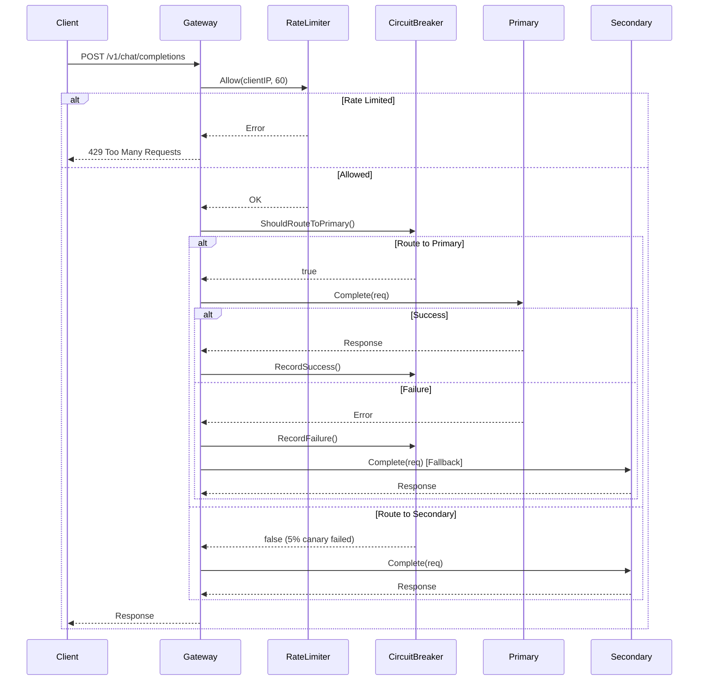
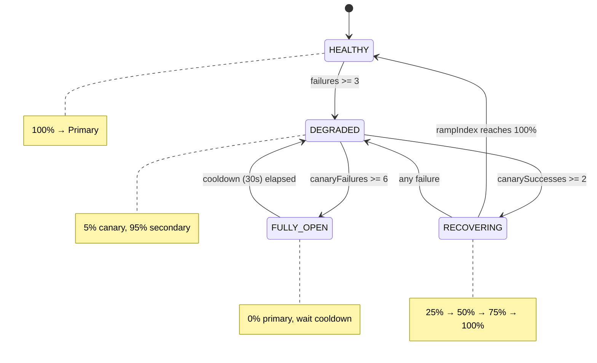

# LLM Gateway - LLD/Machine Coding Interview

A simplified LLM gateway demonstrating **graduated circuit breaker** pattern with canary-based recovery.

**Total: ~740 lines | 8 files | Writable in ~30 mins**

---

## Problem Statement

Design an LLM Gateway that:
1. Routes requests to multiple LLM providers (OpenAI, Anthropic)
2. Handles provider failures gracefully with **graduated traffic shifting**
3. Automatically recovers using **canary-based probing**
4. Rate limits requests per client
5. Performs periodic health checks

---

## Entities & Class Diagram

```
┌─────────────────────────────────────────────────────────────────────┐
│                            ENTITIES                                  │
├─────────────────────────────────────────────────────────────────────┤
│                                                                      │
│  ┌──────────────┐         ┌──────────────────┐                      │
│  │   Gateway    │────────▶│    Provider      │ (interface)          │
│  └──────────────┘    *    └──────────────────┘                      │
│         │                         ▲                                  │
│         │                         │ implements                       │
│         │                 ┌───────┴────────┐                        │
│         │                 │  MockProvider  │                        │
│         │                 └────────────────┘                        │
│         │                                                            │
│         │ 1:*     ┌───────────────────┐                             │
│         ├────────▶│  CircuitBreaker   │ (per provider)              │
│         │         └───────────────────┘                             │
│         │                    │                                       │
│         │                    │ has state                            │
│         │                    ▼                                       │
│         │         ┌───────────────────┐                             │
│         │         │   TrafficState    │ (enum)                      │
│         │         │ HEALTHY/DEGRADED/ │                             │
│         │         │ RECOVERING/OPEN   │                             │
│         │         └───────────────────┘                             │
│         │                                                            │
│         │ 1:1     ┌───────────────────┐                             │
│         ├────────▶│   RateLimiter     │                             │
│         │         └───────────────────┘                             │
│         │                                                            │
│         │ 1:1     ┌───────────────────┐      probes                 │
│         └────────▶│   HealthChecker   │─────────────▶ Providers     │
│                   └───────────────────┘      updates                │
│                            │                    │                    │
│                            └────────────────────┘                    │
│                              CircuitBreakers                         │
│                                                                      │
└─────────────────────────────────────────────────────────────────────┘
```

---

## Entity Details

### 1. CircuitBreaker (Core - ~240 lines)

```go
type CircuitBreaker struct {
    mu               sync.RWMutex
    providerID       string
    state            TrafficState
    cfg              CircuitBreakerConfig

    // HEALTHY state tracking
    failureCount     int

    // DEGRADED state tracking
    canarySuccesses  int
    canaryFailures   int

    // RECOVERING state tracking
    rampIndex        int           // index into [5, 25, 50, 75, 100]
    rampSuccessCount int

    // FULLY_OPEN cooldown
    lastStateChange  time.Time
}

// Core Methods
func (cb *CircuitBreaker) ShouldRouteToPrimary() bool  // Routing decision
func (cb *CircuitBreaker) RecordSuccess()              // After success
func (cb *CircuitBreaker) RecordFailure()              // After failure
func (cb *CircuitBreaker) GetState() TrafficState
func (cb *CircuitBreaker) GetPrimaryPercent() int
```

**State Machine:**
```
HEALTHY (100% → primary)
    │ failures >= threshold (3)
    ▼
DEGRADED (5% canary, 95% secondary)
    │
    ├── canary successes >= 2 → RECOVERING
    ├── canary failures >= 6 → FULLY_OPEN
    ▼
RECOVERING (ramp: 25% → 50% → 75% → 100%)
    │
    ├── any failure → back to DEGRADED
    └── reach 100% → HEALTHY

FULLY_OPEN (0% primary, 100% secondary)
    │ cooldown (30s) elapsed → DEGRADED
```

---

### 2. HealthChecker (~80 lines)

```go
type HealthChecker struct {
    providers  map[string]Provider
    breakers   map[string]*CircuitBreaker
    cfg        HealthCheckConfig
    stopCh     chan struct{}
}

// Methods
func (hc *HealthChecker) Start()                    // Start background goroutine
func (hc *HealthChecker) Stop()                     // Graceful shutdown
func (hc *HealthChecker) checkAll()                 // Probe all providers
func (hc *HealthChecker) checkOne(id, provider)    // Probe single provider
```

**Behavior:**
- Runs every `Interval` (10s)
- On failure → `cb.RecordFailure()`
- On success (if not healthy) → `cb.RecordSuccess()`

---

### 3. RateLimiter (~65 lines)

```go
type RateLimiter struct {
    mu      sync.Mutex
    windows map[string]*window   // key → window
}

type window struct {
    count       int
    windowStart time.Time
}

// Methods
func (rl *RateLimiter) Allow(key string, maxReq int) error
func (rl *RateLimiter) GetCount(key string) int
```

**Algorithm:** Sliding window (1-minute)

---

### 4. Provider (Interface + Mock) (~60 lines)

```go
type Provider interface {
    ID() string
    Complete(req *ChatCompletionRequest) (*ChatCompletionResponse, error)
    HealthCheck() error
    SetHealthy(bool)
}

type MockProvider struct {
    config  ProviderConfig
    healthy bool
}
```

---

### 5. Gateway (~190 lines)

```go
type Gateway struct {
    cfg         *Config
    providers   map[string]Provider
    breakers    map[string]*CircuitBreaker
    rateLimiter *RateLimiter
    healthChk   *HealthChecker
}

// Methods
func NewGateway(cfg *Config) *Gateway
func (gw *Gateway) Start() error
func (gw *Gateway) handleChat(w, r)           // Main handler
func (gw *Gateway) handleHealth(w, r)
func (gw *Gateway) handleProviderControl(w, r)
```

---

### 6. Config (~55 lines)

```go
type Config struct {
    Port              int
    Providers         []ProviderConfig
    MaxRequestsPerMin int
}

type CircuitBreakerConfig struct {
    FailureThreshold    int
    CanarySuccessNeeded int
    RampSuccessNeeded   int
    CooldownDuration    time.Duration
}

type HealthCheckConfig struct {
    Interval time.Duration
    Timeout  time.Duration
}

type ProviderConfig struct {
    ID       string
    Name     string
    Priority int
}
```

---

### 7. Models (DTOs) (~30 lines)

```go
type ChatCompletionRequest struct {
    Model    string
    Messages []ChatMessage
}

type ChatCompletionResponse struct {
    ID       string
    Model    string
    Content  string
    Provider string
}

type ChatMessage struct {
    Role    string
    Content string
}
```

---

## Design Patterns Used

| Pattern | Where | Purpose |
|---------|-------|---------|
| **State Pattern** | CircuitBreaker | 4 states with different behaviors |
| **Strategy Pattern** | Provider interface | Swappable LLM backends |
| **Facade Pattern** | Gateway | Single entry point orchestrating all components |
| **Observer Pattern** | HealthChecker | Monitors providers, updates circuit breakers |
| **Singleton-ish** | RateLimiter | Single instance managing all rate limits |

---

## Request Flow



---

## State Machine Diagram



---

## Traffic Distribution Table

| State | Primary % | Secondary % | Behavior |
|-------|-----------|-------------|----------|
| HEALTHY | 100% | 0% | All traffic to primary |
| DEGRADED | 5% | 95% | Canary probing |
| RECOVERING | 25→50→75→100% | 75→50→25→0% | Gradual ramp-up |
| FULLY_OPEN | 0% | 100% | Complete failover |

---

## File Structure

```
llm-gateway/
├── main.go              (27 lines)  - Entry point
├── config.go            (55 lines)  - Configuration structs
├── models.go            (28 lines)  - Request/Response DTOs
├── provider.go          (59 lines)  - Provider interface + Mock
├── circuitbreaker.go   (237 lines)  - **CORE** State machine
├── healthcheck.go       (78 lines)  - **CORE** Periodic probing
├── ratelimiter.go       (65 lines)  - Sliding window rate limit
├── handler.go          (191 lines)  - Gateway + HTTP handlers
└── go.mod
                        ─────────────
                        ~740 lines total
```

---

## API Endpoints

| Method | Endpoint | Description |
|--------|----------|-------------|
| POST | `/v1/chat/completions` | Chat request (rate limited) |
| GET | `/health` | Provider states & circuit breaker status |
| PUT | `/v1/providers/{id}/down` | Simulate provider failure |
| PUT | `/v1/providers/{id}/up` | Restore provider |

---

## Quick Start

```bash
go run .

# Send request
curl -X POST localhost:8080/v1/chat/completions \
  -H "Content-Type: application/json" \
  -d '{"model":"gpt-4","messages":[{"role":"user","content":"Hi"}]}'

# Check health
curl localhost:8080/health

# Simulate failure (triggers DEGRADED state)
curl -X PUT localhost:8080/v1/providers/openai/down

# Restore (triggers recovery)
curl -X PUT localhost:8080/v1/providers/openai/up
```

---

## Key Interview Talking Points

### Why Graduated Circuit Breaker?
- Traditional binary (OPEN/CLOSED) is too aggressive
- Canary allows safe probing without risking all traffic
- Gradual ramp-up prevents thundering herd on recovery

### Thread Safety
- `sync.RWMutex` in CircuitBreaker for concurrent access
- `sync.Mutex` in RateLimiter for window updates

### Extensibility
- `Provider` interface allows adding real OpenAI/Anthropic
- Config-driven thresholds
- Easy to add more states (e.g., HALF_OPEN)

### Trade-offs
- In-memory rate limiting (loses state on restart) vs Redis
- Simple sliding window vs token bucket
- Mock providers vs real HTTP clients
