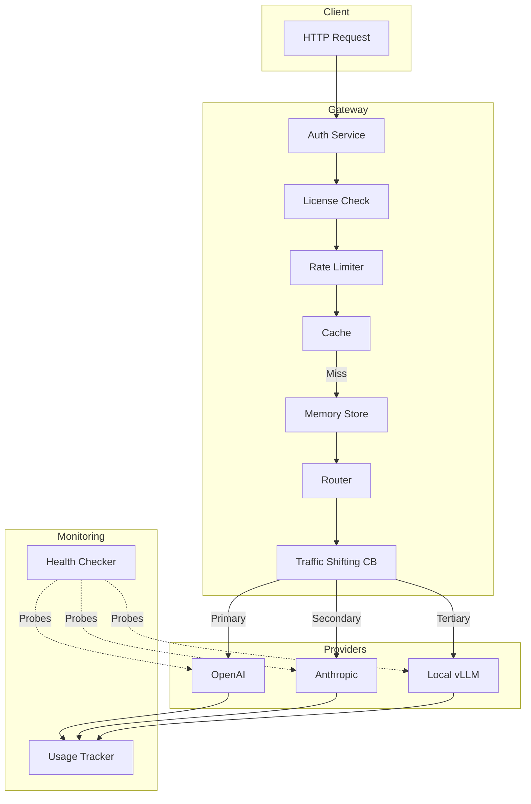
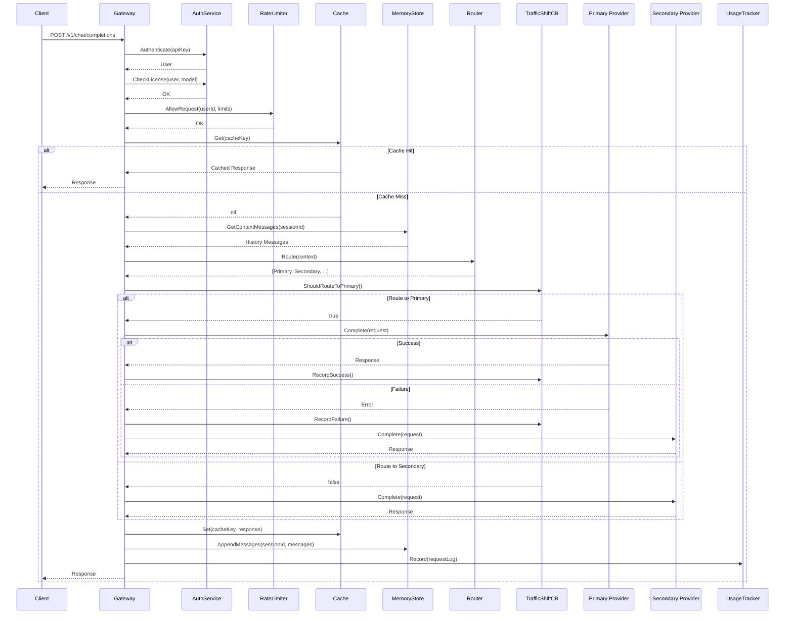
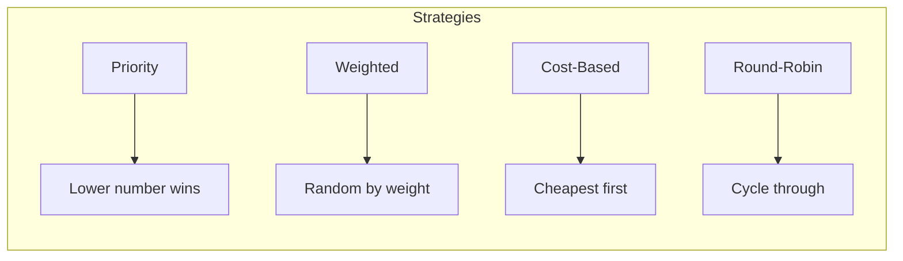
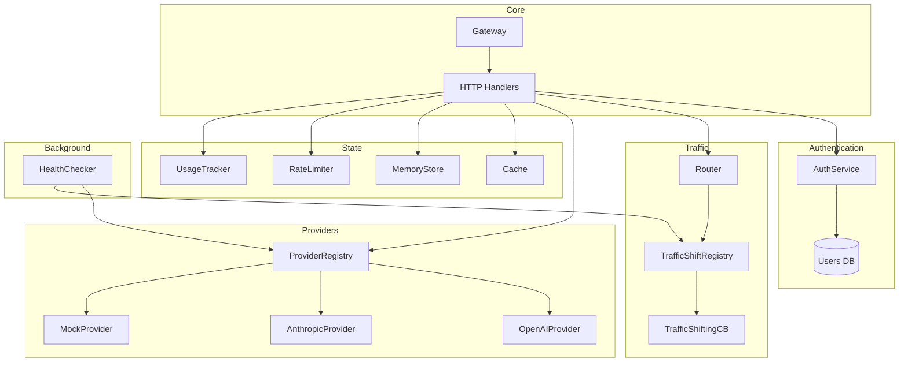
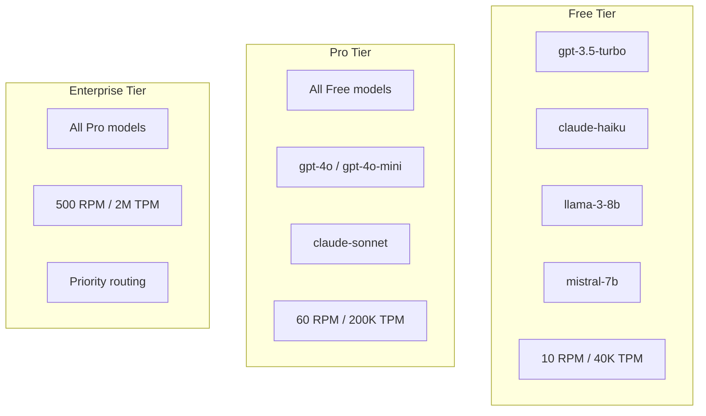
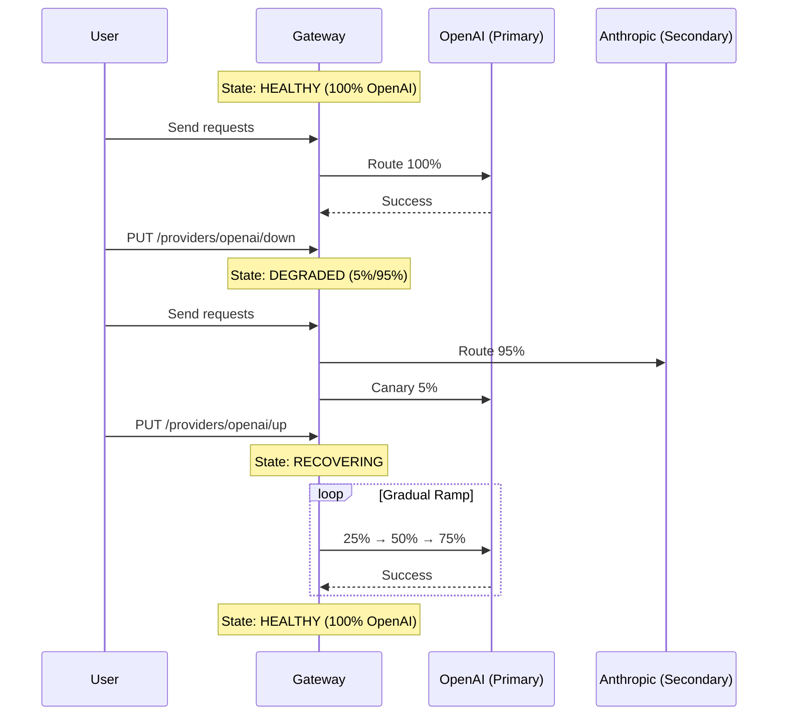

# LLM Gateway

A production-grade LLM Gateway service that provides unified API access to multiple LLM providers (OpenAI, Anthropic, local models) with intelligent traffic management, graduated circuit breaking, and enterprise features.

## Features

- **Multi-Provider Routing** - Route requests to OpenAI, Anthropic, or local models
- **Graduated Traffic Shifting** - Intelligent circuit breaker with canary-based recovery
- **License Tiers** - Free, Pro, and Enterprise tiers with model/rate restrictions
- **Response Caching** - In-memory caching with TTL for identical requests
- **Session Memory** - Cross-model conversation continuity
- **Usage Tracking** - Per-user token and cost accounting
- **Health Checking** - Periodic provider health probes

## Architecture



## Request Processing Pipeline



## Traffic Shifting State Machine

The gateway uses a graduated circuit breaker instead of binary open/closed states:

```mermaid
stateDiagram-v2
    [*] --> HEALTHY

    HEALTHY --> DEGRADED: failures >= threshold

    DEGRADED --> RECOVERING: canary successes >= needed
    DEGRADED --> FULLY_OPEN: canary failures >= max

    RECOVERING --> HEALTHY: reached 100%
    RECOVERING --> DEGRADED: any failure during ramp

    FULLY_OPEN --> DEGRADED: cooldown elapsed

    note right of HEALTHY: 100% to primary
    note right of DEGRADED: 5% canary to primary\n95% to secondary
    note right of RECOVERING: Ramp: 25% → 50% → 75% → 100%
    note right of FULLY_OPEN: 0% to primary\n100% to secondary
```

### Traffic Distribution by State

| State | Primary % | Secondary % | Behavior |
|-------|-----------|-------------|----------|
| HEALTHY | 100% | 0% | All traffic to primary |
| DEGRADED | 5% | 95% | Canary probing primary |
| RECOVERING | 25→50→75→100% | 75→50→25→0% | Gradual ramp-up |
| FULLY_OPEN | 0% | 100% | Complete failover |

## Routing Strategies



## Component Interactions



## License Tiers



## API Endpoints

| Method | Endpoint | Description |
|--------|----------|-------------|
| POST | `/v1/chat/completions` | Main chat completion API (OpenAI-compatible) |
| GET | `/health` | Gateway health status |
| GET | `/v1/providers/status` | Traffic shift states for all providers |
| GET | `/v1/usage` | Usage and cost tracking |
| GET | `/v1/cache/stats` | Cache statistics |
| PUT | `/v1/providers/{id}/down` | Simulate provider failure |
| PUT | `/v1/providers/{id}/up` | Restore provider |

## Quick Start

```bash
# Run the gateway
go run .

# Test with a request
curl -X POST http://localhost:8080/v1/chat/completions \
  -H "Authorization: Bearer gw-pro-key-456" \
  -H "Content-Type: application/json" \
  -d '{"model":"gpt-4o","messages":[{"role":"user","content":"Hello!"}]}'
```

## Demo API Keys

| Tier | API Key |
|------|---------|
| Free | `gw-free-key-123` |
| Pro | `gw-pro-key-456` |
| Enterprise | `gw-ent-key-789` |

## Demo Flow



## File Structure

```
├── main.go            # Entry point
├── handler.go         # Gateway struct and HTTP handlers
├── models.go          # Data structures
├── config.go          # Configuration
├── router.go          # Provider selection and ordering
├── circuitbreaker.go  # Graduated traffic-shifting CB
├── provider.go        # Provider adapters (OpenAI, Anthropic, Mock)
├── auth.go            # Authentication and license checking
├── cache.go           # Response caching
├── ratelimiter.go     # Per-user rate limiting
├── memory.go          # Session/conversation memory
├── usage.go           # Token and cost tracking
├── healthcheck.go     # Provider health probing
└── go.mod             # Go module file
```

## Configuration

Default configuration is set in `config.go`. Key settings:

- **Port**: 8080
- **Routing Strategy**: Priority-based
- **Cache TTL**: 3600 seconds
- **Health Check Interval**: 30 seconds
- **Circuit Breaker Thresholds**:
  - Failure threshold: 5
  - Canary successes needed: 3
  - Ramp successes needed: 5
  - Cooldown: 60 seconds
